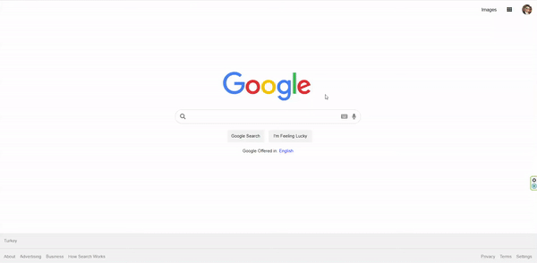

# HTML-CSS-Google-Clone# HTML_CSS_Google_clone

## Description

Project aims to create Google_clone within html and css.

| Project Name                                                        | Libraries and Technologies I use | How does my project look                   |
| :------------------------------------------------------------------ | -------------------------------- | ------------------------------------------ |
| [Google_clone](https://muratergon.github.io/HTML-CSS-Google-Clone/) | Html Css                         |  |

## Problem Statement

- My project to improve html and css tutorials

## Project Design

- Figma

## Project Skeleton

```
Google_clone (folder)
|----images
|----readme.md
|----index.html
|----style.css

```

## Expected Outcome

## Objective

Functionally create a Google_clone as in the image above

### At the end of the project, following topics are to be covered;

- HTML Toolbar, sign in

- HTML Search bar

- CSS Colors-Border Properties

- CSS Margins-Padding

- CSS Properties for Texts-Font Families-Links

### At the end of the project, students will be able to;

- improve coding skills within HTML & CSS

- use git commands (push, pull, commit, add etc.) and Github as Version Control System.

## Steps to Solution

- Step 1: Download or clone project repo on Github

- Step 2: Create project folder for local public repo on your pc

- Step 3: Google_clone

> > Part-1 HTML Structure

    - Creat structure of the HTML5
    - Give name of your project (title)
    - Create the main structure of the container (div id="container")
    - Create Main Topic of the project (id="title")
    - Create a description of your project (id="description")
    - Create a form (id="Google_clone")

> > Part-2 CSS Structure

    - Set a background and define font-color="white"
    - Set container background color and margin
    - Define "title" and "description" color-size-padding etc...
    - Define "Google_clone" color-size-padding etc..
    - Define labels color-size-padding etc...
    - Set class color-size-padding-margin etc...
    - Define id="submit" color-size-padding etc...

- Step 4: Push your application into your own public repo on Github

- Step 5: Deploy your application on Github template to showcase your app within your team.

## Notes

- You can use HTML,and CSS to complete this project.

## Resources

<center> &#8987; Happy Coding  &#9997; </center>
